# BiginVibe Working Flow (Current Implementation)

This document describes the code as it exists today.

## PM Overview

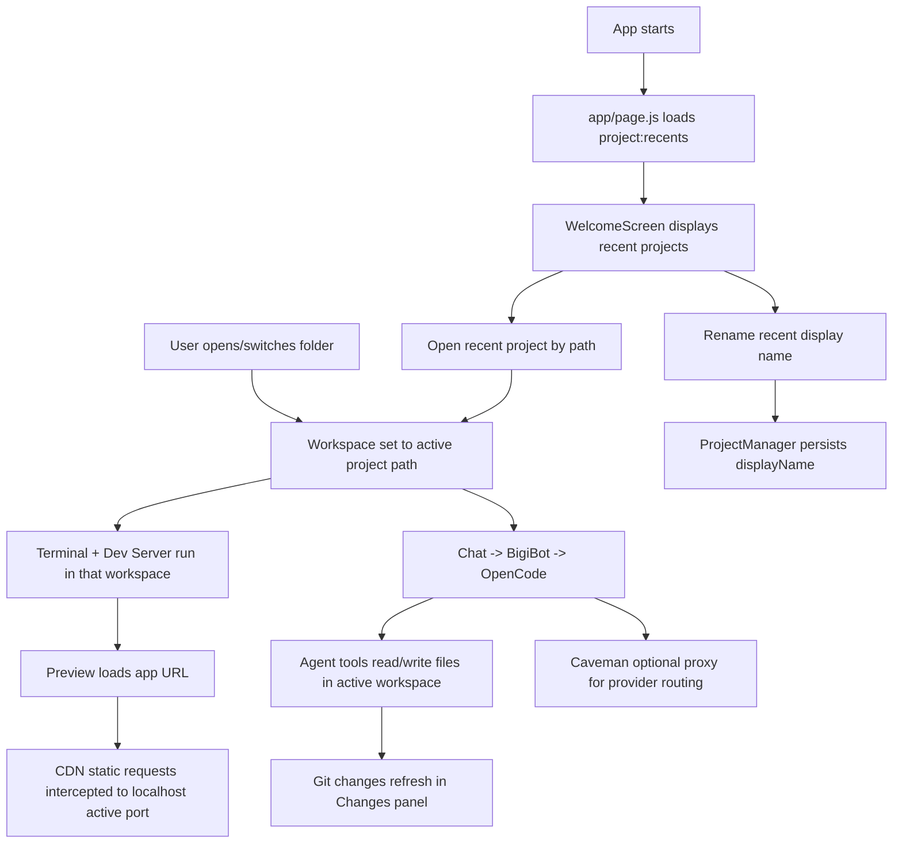

| Topic | Current behavior |
|---|---|
| Folder import | Top bar `Open Project`/`Switch Project` selects directory and sets active workspace via `WorkspaceManager`. |
| Recent projects | `app/page.js` loads `project:recents` on startup; `WelcomeScreen` displays the five most recent existing paths. |
| Recent display names | Optional `displayName` is stored with the recent record. It changes Welcome presentation only; filesystem `path` remains project identity. |
| Workspace scope | Active workspace path is propagated to terminal, dev server, OpenCode agent, and Git operations. |
| Port allocation | Lyte dev server uses first free port in `3000..3009` (`lyte serve --port <n>`). |
| Network interception | Preview intercepts CDN `static.localzohocdn.com/.../biginclient/...` and rewrites to `http://localhost:<active-port>/...`. |
| OpenCode flow | Chat -> BigiBot -> OpenCode SDK client -> local `opencode serve` process rooted at project `cwd`. |
| Caveman flow | Optional provider proxy routing; enabled by env/script (`npm run dev:caveman`), visible as chat status ON/OFF. |
| File editing | Agent tool edits emit events; UI refreshes Changes panel from Git status/diff. |
| SSL for LocalZoho | Preview uses scoped client-certificate selection (`select-client-certificate`) for approved LocalZoho hosts and preview partition only. |

## 1) Architecture

```mermaid
flowchart TD
  subgraph Renderer[Renderer (Next.js)]
    P[app/page.js]
    C1[components/ProjectControls]
    C2[components/Chat]
    C3[components/Terminal]
    C4[components/Preview]
    C5[components/Changes]
    C6[components/Welcome]
  end

  subgraph Bridge[Preload/Bridge]
    PR[electron/preload.js]
    BR[lib/bridge.js]
  end

  subgraph Main[Electron Main]
    M[electron/main.js]
    RB[services/runtimeBus.js]
  end

  subgraph Services[Services]
    WS[WorkspaceManager]
    PM[ProjectManager]
    TB[TerminalManager]
    EM[EnvironmentManager]
    BB[BigiBotService]
    OC[OpenCodeService]
    GM[GitManager]
    RM[RedirectorManager]
  end

  subgraph External[External Process]
    OP[opencode serve]
    CV[caveman start/proxy]
    PTY[node-pty shell]
    GIT[git CLI]
  end

  subgraph Preview[Preview]
    WV[Renderer webview partition=persist:bigin-preview]
    CCP[PreviewClientCertificatePolicy]
    SRI[PreviewStaticResourceInterceptor]
  end

  P --> BR --> PR --> M
  C6 --> P
  M --> WS
  M --> PM
  M --> TB
  M --> EM
  M --> BB
  M --> GM
  EM --> RM
  TB --> PTY
  OC --> OP
  OC --> CV
  GM --> GIT
  C4 --> WV
  M --> CCP
  M --> SRI
  RB --> M --> P
```

| Layer | Actual files | Notes |
|---|---|---|
| Renderer | `app/page.js`, `components/*` | UI + state, no direct Node API |
| Preload/Bridge | `electron/preload.js`, `lib/bridge.js` | `window.biginVibe` API surface |
| Main | `electron/main.js` | IPC handlers + service wiring |
| Services | `services/*` | Project/workspace/terminal/env/chat/git/preview policies |
| External | `opencode`, `caveman`, `node-pty`, `git` | Spawned by services |

## 2) Startup & Workspace

### Application startup

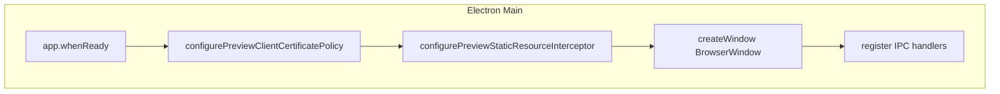

- `electron/main.js` constructs singleton services (`TerminalManager`, `EnvironmentManager`, `GitManager`, `BigiBotService`) and injects dependencies into `WorkspaceManager`.
- Runtime events are forwarded on a single channel: `runtime-event` (`services/runtimeBus.js` -> `electron/main.js` -> renderer subscription).

### Open project

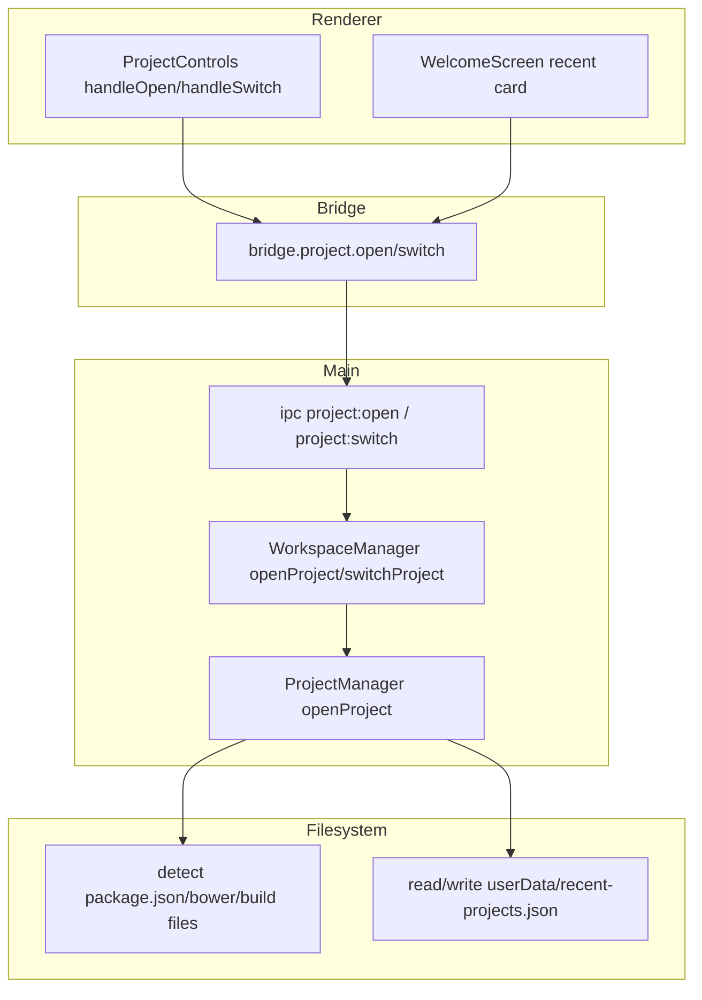

- `WorkspaceManager` is the authoritative owner of active workspace state (`_project`, `_opencodeSessionId`, `_devServer`, `_previewUrl`) in `services/workspace/WorkspaceManager.js`.
- There is no variable literally named `activeProjectPath`; active path is stored as `this._project.path` and exposed as `snapshot.projectPath`.
- `project:open` switches atomically when a project already exists.
- Opening a recent project passes its filesystem `path`; `displayName` is never used as the project identifier.
- `_addToRecents()` updates recency and `lastOpenedAt` while preserving an existing `displayName`.
- `getRecentProjects()` normalizes records, removes missing paths, sorts by `lastOpenedAt`, and rewrites the normalized list.

### Recent project loading and rename

```mermaid
flowchart TD
  A[app/page.js startup] --> B[bridge.project.recents]
  B --> C[project:recents]
  C --> D[ProjectManager.getRecentProjects]
  D --> E[userData/recent-projects.json]
  D --> F[recentProjects renderer state]
  F --> G[WelcomeScreen: first five cards]
  G --> H[Inline rename]
  H --> I[bridge.project.renameRecent(path, displayName)]
  I --> J[project:renameRecent]
  J --> K[ProjectManager.renameRecentProject]
  K --> E
  K --> L[refreshRecents]
  L --> F
```

- Recent records have the shape `{ path, name, lastOpenedAt, displayName? }`.
- `name` is derived from the filesystem basename; `displayName` is optional user-facing metadata.
- Cards display `displayName || name || "Unnamed project"`.
- Rename trims the input and rejects an empty value. Persistence errors remain visible through the Welcome error state.
- Existing records without `displayName` remain compatible and continue to use the basename fallback.
- Electron stores the file under `app.getPath("userData")`; non-Electron contexts use `~/.bigin-vibe/recent-projects.json`.

### Active workspace propagation

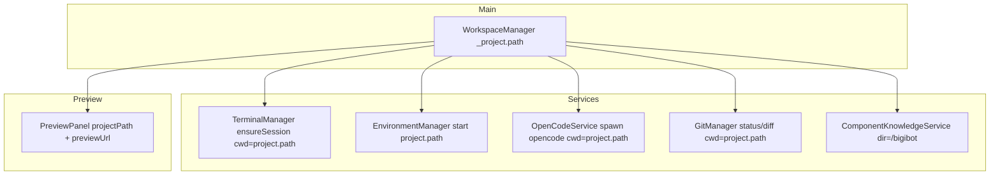

Workspace isolation status:
- Strong: Terminal (`terminal:create`), OpenCode server spawn (`cwd: project.path`), Git (`cwd` from active project), environment command execution (`ensureSession` with project cwd).
- Gap: `WORKSPACE_SWITCHED` event constant exists but is never emitted; UI still handles it in `app/page.js`.
- Gap: No file explorer implementation exists in current repo (only mentions in comments/docs).

## 3) BigiBot/OpenCode

### Chat -> BigiBot -> OpenCode

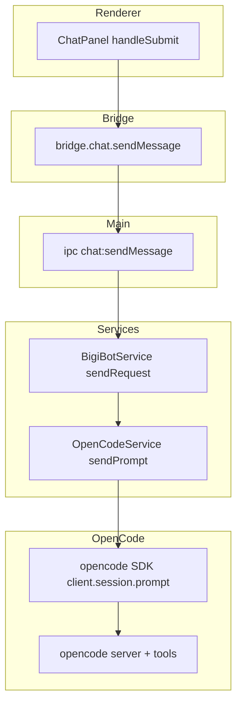

- Entry point: `chat:sendMessage` in `electron/main.js`.
- `BigiBotService.sendRequest()` composes prompt layers: workspace header + user request + optional matched KB context.
- Session handling: `BigiBotService.ensureSession()` and `OpenCodeService.createSession()`.
- OpenCode server lifecycle is per active project, spawned by `OpenCodeService._ensureServerForProject()`.

### Agent/subagent loop and event handling

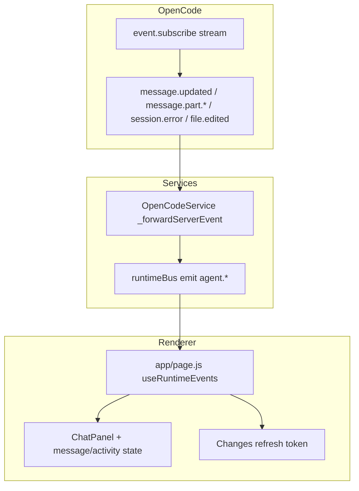

Actual event mapping highlights (`services/opencode/OpenCodeService.js`):
- `message.part.*` with `part.type === "tool"` -> `agent.tool.started/completed` + `agent.activity` labels.
- `part.type === "text"` -> `agent.message` delta stream.
- `message.updated`/`message.created`/`message.completed` assistant text -> `agent.message` final.
- `file.edited` -> `agent.file.changed`.
- `session.error` -> `agent.activity failed`, `agent.error`, `agent.completed`.
- Prompt-level fallback paths attempt text extraction from multiple payload shapes and list APIs.

## 4) Terminal & Dev Server

### Terminal/PTY lifecycle

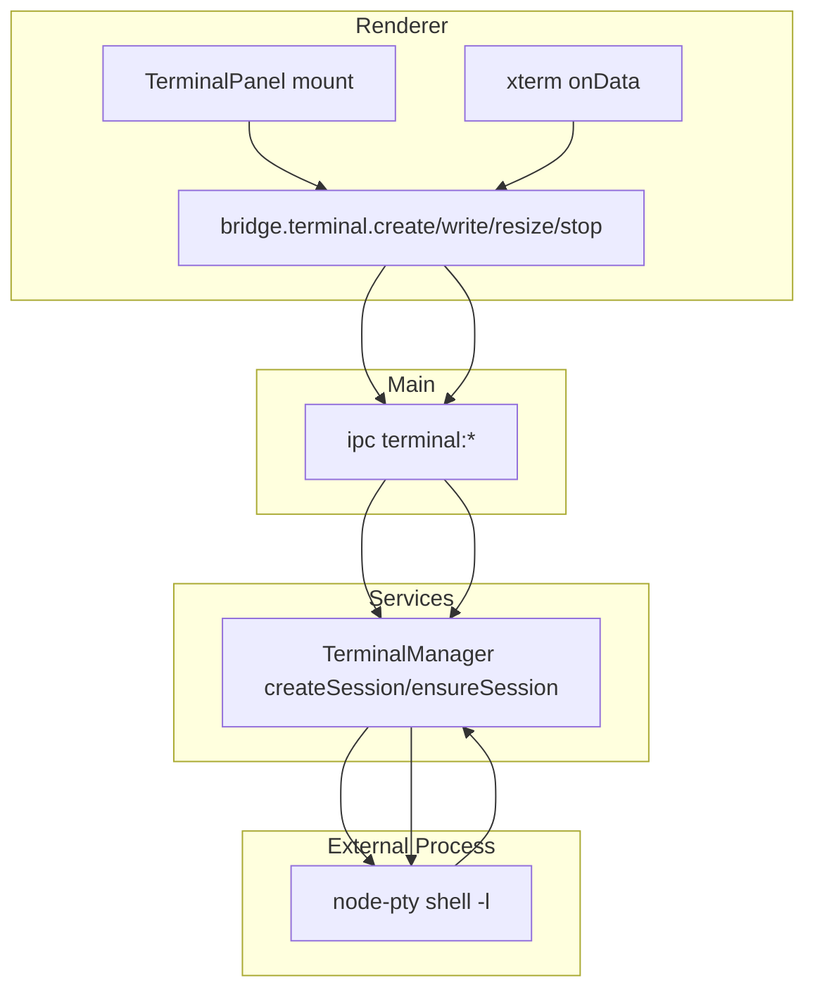

- `TerminalManager` uses `node-pty` with login shell (`$SHELL` or `/bin/zsh`, args `-l`).
- Output: `onData` -> `terminal.output`; exit: `onExit` -> `terminal.exit`.
- Input: all raw bytes pass via `write()`; Ctrl+C (`\x03`) also emits `terminal.interrupt`.
- Resize path: renderer fit -> `terminal:resize` -> `pty.resize`.

### Start Dev Server flow

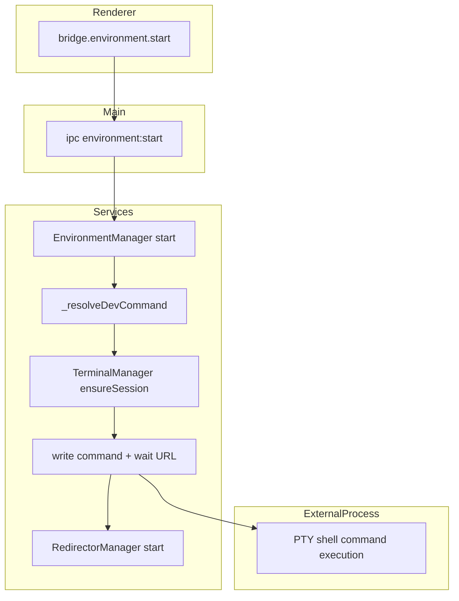

Current behavior details:
- Environment command is executed by typing into the same terminal session (`TerminalManager.write(sessionId, command + "\r")`).
- For Lyte projects: `_resolveDevCommand()` returns `<lyteBin or lyte> serve --port <first free 3000..3009>`.
- There is no renderer control currently calling `bridge.environment.start/stop/restart`; IPC and service exist, but no visible Start/Stop button in current components.

### Dev Server failure flow

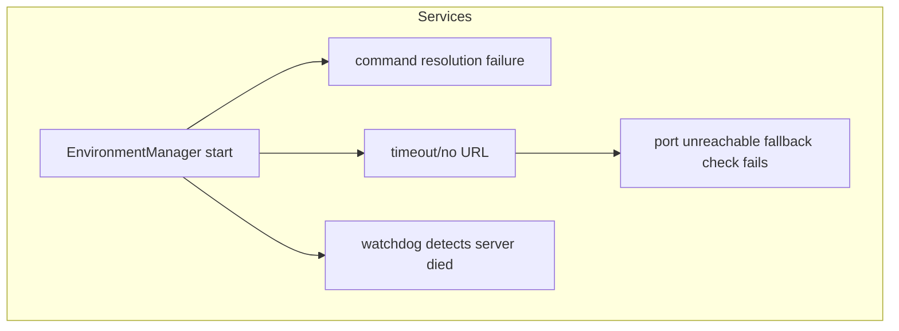

Failure handling:
- Command resolution errors (`build-js`, `none`, ports exhausted) emit `environment.error` and throw.
- If URL is not detected for Lyte, it verifies `detectedPort` is listening; otherwise sends Ctrl+C and errors.
- Runtime watchdog polls serving port every 3s; if dead, marks environment stopped.

## 5) Preview

### Preview navigation lifecycle

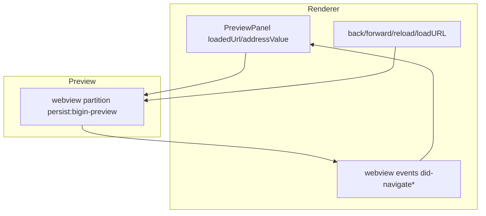

- Actual preview surface is renderer `<webview>` (`components/Preview/PreviewPanel.js`), not `BrowserView` or `WebContentsView`.
- BrowserWindow enables `webviewTag: true` in `electron/main.js`.
- Address bar is editable; Enter calls `webview.loadURL(target)` directly.

### URL editing flow

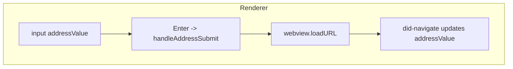

- `previewGeneration` from `app/page.js` resets preview URL only on real environment restart/start events.
- Manual URL edits persist across unrelated rerenders.

### LocalZoho SSL/client-certificate flow

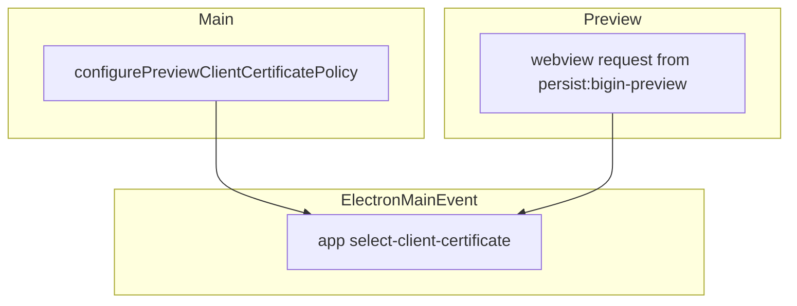

- `PreviewClientCertificatePolicy` handles `app.on("select-client-certificate")`.
- Scope checks: preview partition + host allowlist (`APPROVED_PREVIEW_HOSTS`) from `services/preview/PreviewSecurityConstants.js`.
- Current selection strategy: chooses first certificate from provided list.

Obsolete/duplicate SSL workaround status:
- No active `setCertificateVerifyProc()` module in codebase.
- Comments document a prior removed approach; current active SSL-related code is client-certificate selection plus static-resource interception.

## 6) Filesystem & Git

### File modification propagation

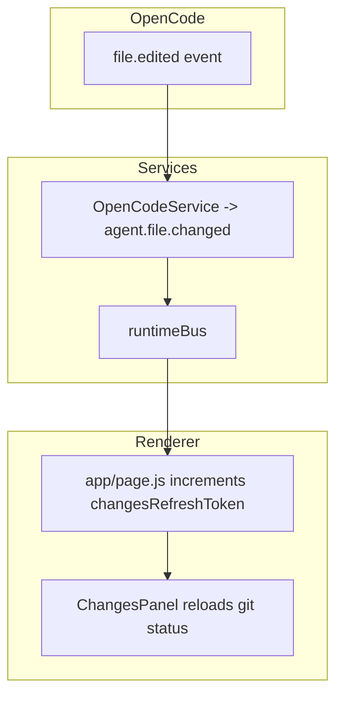

- There is no in-app file explorer read/write implementation in current renderer/components.
- Filesystem interactions currently occur in services for project detection, recent-project metadata, instance list file, BigiBot KB reads, environment lock cleanup.
- `ProjectManager` persists recents in `app.getPath("userData")/recent-projects.json` and falls back to `~/.bigin-vibe/recent-projects.json` outside Electron. It normalizes legacy `openedAt` values to `lastOpenedAt`, removes missing paths, sorts records, and preserves optional `displayName`.

### Git flow (status/diff plus refresh)

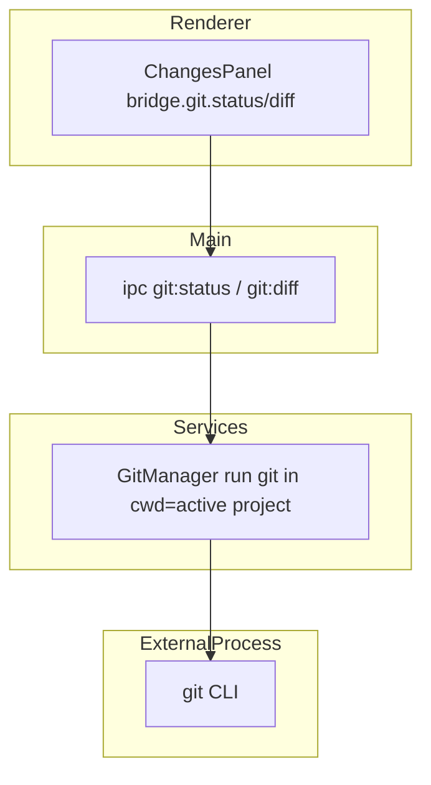

- `GitManager` executes `git status --porcelain=v1` and `git diff` in active project cwd.
- `git:refresh` can fetch remote state; no commit or push APIs are exposed.

## 7) IPC Communication

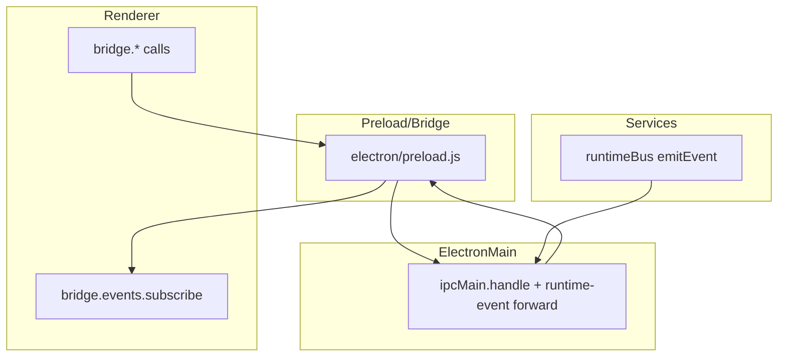

Primary IPC channels in `electron/main.js`:
- Workspace: `workspace:current`
- Project: `project:pickDirectory`, `project:open`, `project:switch`, `project:close`, `project:current`, `project:recents`, `project:renameRecent`
- Environment: `environment:start`, `environment:stop`, `environment:restart`, `environment:status`
- Terminal: `terminal:create`, `terminal:write`, `terminal:resize`, `terminal:stop`, `terminal:list`
- Chat: `chat:listSessions`, `chat:newSession`, `chat:openSession`, `chat:sessionMessages`, `chat:renameSession`, `chat:forkSession`, `chat:deleteSession`, `chat:sendMessage`, `chat:cancel`, `chat:model`, `chat:models`, `chat:agents`, `chat:cavemanStatus`
- Preview: `preview:instances`
- Git: `git:status`, `git:statusModel`, `git:refresh`, `git:diff`, `git:diffCached`

The recent-project rename bridge is:

```text
WelcomeScreen
  -> app/page.js
  -> lib/bridge.js
  -> electron/preload.js
  -> project:renameRecent
  -> ProjectManager.renameRecentProject()
  -> recent-projects.json
```

## Workspace switching

```mermaid
flowchart TD
  subgraph Renderer
    R[ProjectControls handleSwitch]
  end
  subgraph Main
    M[ipc project:switch]
  end
  subgraph Services
    W1[WorkspaceManager switchProject]
    W2[_teardownCurrentWorkspace]
    E[EnvironmentManager.stop]
    B[BigiBotService.shutdown]
    T[TerminalManager.closeAll]
    W3[openProject(newPath)]
  end
  R --> M --> W1 --> W2
  W2 --> E
  W2 --> B
  W2 --> T
  W2 --> W3
```

- Teardown order is explicit in `WorkspaceManager._teardownCurrentWorkspace()`.
- `WorkspaceManager` does not emit `workspace.switched`; current code emits `workspace.opened` for the new workspace.

## Complete end-to-end workflow

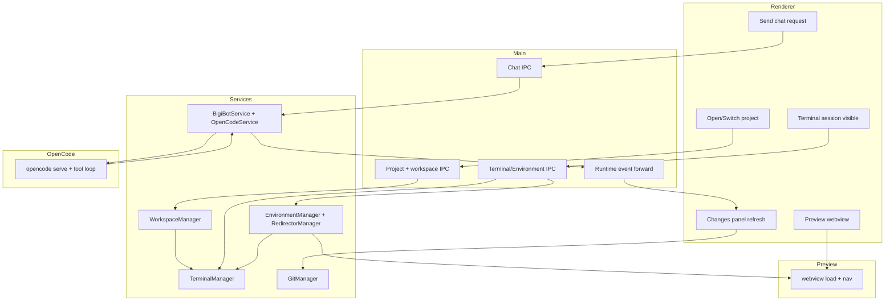

End-to-end notes:
- Open project sets active workspace in `WorkspaceManager`.
- Welcome recent cards open projects using their filesystem `path`; custom `displayName` values do not affect workspace identity.
- Terminal is the execution surface for both user commands and environment start commands.
- Preview URL is derived by `EnvironmentManager` + `RedirectorManager` and loaded into renderer webview.
- Chat triggers BigiBot/OpenCode; tool/file events propagate back to UI via runtime bus.

---

## Current Architecture Summary

- One-window Electron app with Next.js renderer.
- Single IPC boundary via preload-exposed `window.biginVibe`.
- Workspace authority centralized in `WorkspaceManager`.
- AI path: `ChatPanel` -> `chat:sendMessage` -> `BigiBotService` -> `OpenCodeService` -> spawned `opencode serve`.
- Terminal path uses `node-pty`; environment start composes with same PTY session.
- Preview uses renderer `<webview>` partition with scoped client-cert policy and static resource interceptor.

## State Ownership

| State | Owner | File |
|---|---|---|
| Active project/workspace snapshot | `WorkspaceManager` | `services/workspace/WorkspaceManager.js` |
| Terminal sessions + primary session id | `TerminalManager` | `services/terminal/TerminalManager.js` |
| Dev server running/command/port/preview URL | `EnvironmentManager` | `services/environment/EnvironmentManager.js` |
| BigiBot KB cache + priming map | `BigiBotService` | `services/bigibot/BigiBotService.js` |
| OpenCode server/client/session maps | `OpenCodeService` | `services/opencode/OpenCodeService.js` |
| Durable recent-project metadata | `ProjectManager` | `services/project/ProjectManager.js` + `app.getPath("userData")/recent-projects.json` |
| Renderer recent-project list and Welcome status | `app/page.js` | `app/page.js` |
| Recent-card presentation and rename draft | `WelcomeScreen` | `components/Welcome/WelcomeScreen.js` |
| Renderer chat/preview/ui state | `app/page.js` + components | `app/page.js` |

## Known Gaps / Risks

- `workspace.switched` event is defined but never emitted; UI handles it anyway.
- Environment start/stop controls are exposed through IPC but no current renderer component triggers them.
- No file explorer implementation exists in current code (despite architectural mentions).
- OpenCode prompt body has `model` commented out; effective model selection depends on provider/OpenCode defaults and agent configuration.
- `TerminalPanel` creates sessions with `terminal:create` while `EnvironmentManager` uses internal `ensureSession`; they usually converge via primary-session logic but are independent call paths.

## Important Source Files

- `electron/main.js`
- `electron/preload.js`
- `lib/bridge.js`
- `app/page.js`
- `components/ProjectControls/ProjectControls.js`
- `components/Chat/ChatPanel.js`
- `components/Preview/PreviewPanel.js`
- `components/Terminal/TerminalPanel.js`
- `components/Changes/ChangesPanel.js`
- `components/Welcome/WelcomeScreen.js`
- `services/workspace/WorkspaceManager.js`
- `services/project/ProjectManager.js`
- `services/environment/EnvironmentManager.js`
- `services/environment/RedirectorManager.js`
- `services/terminal/TerminalManager.js`
- `services/bigibot/BigiBotService.js`
- `services/opencode/OpenCodeService.js`
- `services/opencode/OpenCodeEventClassifier.js`
- `services/preview/PreviewClientCertificatePolicy.js`
- `services/preview/PreviewStaticResourceInterceptor.js`
- `services/git/GitManager.js`
- `services/runtimeBus.js`
- `shared/events.js`

## Developer Quick Reference

- Get current workspace snapshot: `workspace:current`.
- Open/switch/close project: `project:open`, `project:switch`, `project:close`.
- Load recent projects: `project:recents`.
- Rename a recent project: `project:renameRecent(projectPath, displayName)`.
- Recent-project persistence: `app.getPath("userData")/recent-projects.json`.
- Project identity is the filesystem path; `displayName` is optional presentation metadata.
- Send chat request: `chat:sendMessage(text, mode)`.
- Cancel chat: `chat:cancel`.
- Check Caveman routing status: `chat:cavemanStatus`.
- Terminal lifecycle: `terminal:create` -> `terminal:write` -> `terminal:resize` -> `terminal:stop`.
- Start/stop/restart environment (IPC exists): `environment:start`, `environment:stop`, `environment:restart`.
- Preview host/instance list source: `~/.bigin-vibe/instances.json` via `preview:instances`.
- Git status/diff and refresh: `git:status`, `git:diff`, `git:refresh`.
